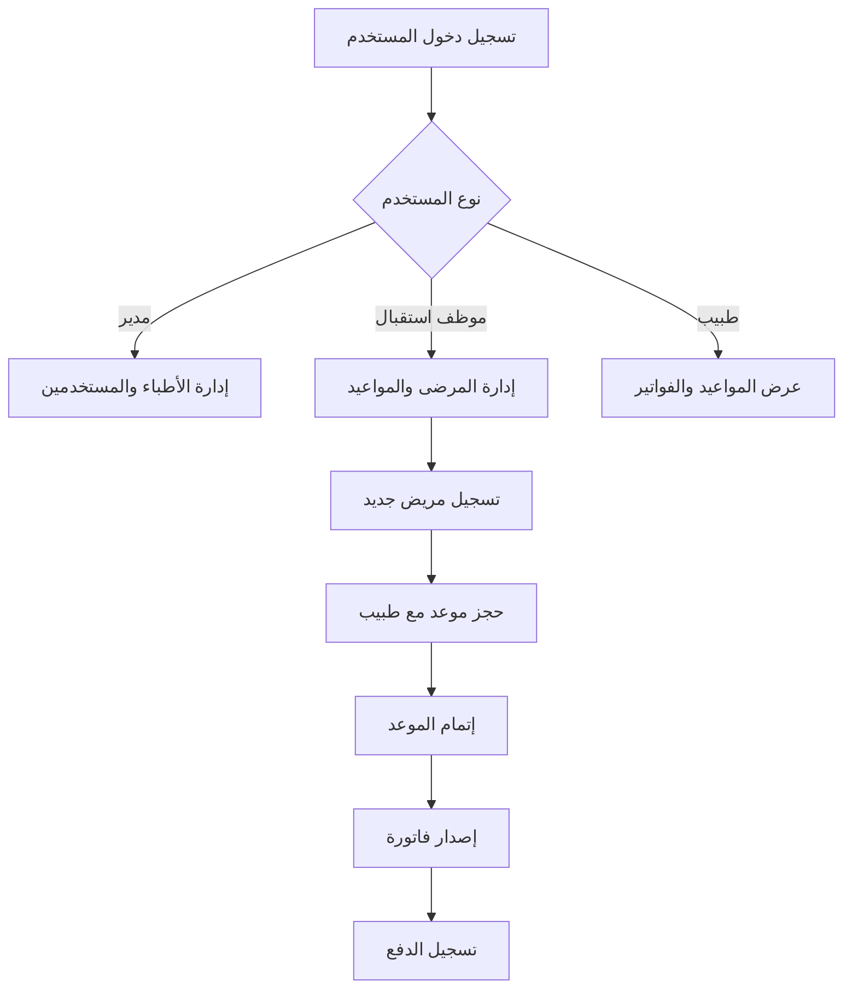

# 🏥 نظام إدارة العيادة الطبية - Clinic Management System

<div align="center">


**نظام شامل لإدارة العيادات الطبية بشكل احترافي ومنظم**

[المميزات](#-المميزات) • [التثبيت](#-التثبيت) • [الاستخدام](#-الاستخدام) • [الهيكل](#-هيكل-المشروع) • [المساهمة](#-المساهمة)

</div>

---

## 📋 نظرة عامة

نظام إدارة العيادة الطبية هو نظام متكامل مبني بلغة Python لإدارة جميع عمليات العيادة بما في ذلك:
- إدارة المرضى والأطباء
- حجز وإدارة المواعيد
- إصدار الفواتير والمدفوعات
- نظام المستخدمين والصلاحيات

---

## ✨ المميزات

### 🩺 **إدارة الأطباء**
- ✅ إضافة أطباء جدد مع تفاصيل كاملة (الاسم، التخصص، الهاتف، البريد)
- ✅ عرض قائمة جميع الأطباء
- ✅ تحديث بيانات الأطباء
- ✅ حذف الأطباء من النظام
- ✅ البحث عن طبيب معين

### 👥 **إدارة المرضى**
- ✅ تسجيل مرضى جدد (الاسم، العمر، الجنس، الهاتف، العنوان)
- ✅ عرض سجلات جميع المرضى
- ✅ تحديث معلومات المرضى
- ✅ حذف سجلات المرضى
- ✅ البحث والاستعلام عن المرضى

### 📅 **إدارة المواعيد**
- ✅ حجز مواعيد للمرضى مع الأطباء
- ✅ تحديد تاريخ ووقت الموعد
- ✅ تسجيل سبب الزيارة
- ✅ تحديث حالة الموعد (محجوز / منتهي / ملغى)
- ✅ حذف المواعيد
- ✅ عرض جميع المواعيد

### 💰 **إدارة الفواتير**
- ✅ إصدار فواتير للمواعيد
- ✅ تحديد المبلغ وطريقة الدفع (نقدي / بطاقة / تحويل)
- ✅ منع تكرار الفواتير للموعد الواحد
- ✅ تحديث بيانات الفواتير
- ✅ حذف الفواتير
- ✅ عرض جميع الفواتير

### 🔐 **نظام الأمان**
- ✅ نظام المستخدمين مع صلاحيات متعددة
- ✅ أدوار المستخدمين (مدير / طبيب / موظف استقبال)
- ✅ تشفير كلمات المرور
- 🔜 نظام تسجيل الدخول والخروج

### 📊 **قاعدة البيانات**
- ✅ قاعدة بيانات SQLite محلية
- ✅ استخدام SQLAlchemy ORM للأمان والمرونة
- ✅ علاقات بين الجداول (Foreign Keys)
- ✅ معالجة الأخطاء التلقائية

---

## 🛠️ التقنيات المستخدمة

| التقنية | الغرض | الإصدار |
|---------|-------|---------|
| **Python** | لغة البرمجة الأساسية | 3.12 |
| **SQLAlchemy** | ORM لإدارة قاعدة البيانات | 2.x |
| **SQLite** | قاعدة البيانات | 3.x |
| **Git** | نظام التحكم بالإصدارات | - |

---

## 📦 التثبيت

### المتطلبات الأساسية
- Python 3.12 أو أحدث
- pip (مدير الحزم)
- Git

### خطوات التثبيت

```bash
# 1. استنساخ المشروع
git clone https://github.com/sami7q/ClinicSystem.git
cd ClinicSystem

# 2. إنشاء بيئة افتراضية
python -m venv venv

# 3. تفعيل البيئة الافتراضية
# على Windows:
venv\Scripts\activate
# على Linux/Mac:
source venv/bin/activate

# 4. تثبيت المكتبات المطلوبة
pip install sqlalchemy

# 5. تهيئة قاعدة البيانات
python -m core.db
```

---

## 🚀 الاستخدام

### تهيئة قاعدة البيانات

```bash
python -m core.db
```

### أمثلة الاستخدام

#### إضافة طبيب جديد

```python
from core.services.doctors_service import create_doctor

doctor = create_doctor(
    name="د. أحمد محمد",
    specialty="طب الأطفال",
    phone="0501234567",
    email="ahmad@clinic.com"
)
```

#### إضافة مريض جديد

```python
from core.services.patients_service import create_patient

patient = create_patient(
    name="محمد علي",
    age=35,
    gender="ذكر",
    phone="0509876543",
    address="الرياض، حي النخيل"
)
```

#### حجز موعد

```python
from datetime import datetime
from core.services.appointments_service import create_appointment

appointment = create_appointment(
    patient_id=1,
    doctor_id=1,
    date=datetime(2025, 10, 15, 10, 0),
    reason="فحص دوري"
)
```

#### إصدار فاتورة

```python
from core.services.invoices_service import create_invoice

invoice = create_invoice(
    appointment_id=1,
    amount=200.00,
    payment_method="cash"
)
```

---

## 📁 هيكل المشروع

```
ClinicSystem/
│
├── 📂 app/                          # التطبيق الرئيسي
│   └── main.py                      # نقطة الدخول الرئيسية (قيد التطوير)
│
├── 📂 core/                         # المكونات الأساسية للنظام
│   ├── db.py                        # ⚙️ إدارة قاعدة البيانات والاتصال
│   ├── models.py                    # 📊 تعريف الجداول والعلاقات
│   ├── security.py                  # 🔐 نظام الأمان والمصادقة (قيد التطوير)
│   ├── licensing.py                 # 📜 نظام الترخيص (قيد التطوير)
│   │
│   └── 📂 services/                 # خدمات الأعمال (Business Logic)
│       ├── doctors_service.py       # 🩺 خدمات إدارة الأطباء
│       ├── patients_service.py      # 👥 خدمات إدارة المرضى
│       ├── appointments_service.py  # 📅 خدمات إدارة المواعيد
│       └── invoices_service.py      # 💰 خدمات إدارة الفواتير
│
├── 📂 data/                         # مجلد قاعدة البيانات
│   └── clinic.db                    # قاعدة البيانات SQLite
│
├── 📂 tests/                        # الاختبارات (قيد التطوير)
│
├── .gitignore                       # ملفات Git المستبعدة
├── requirements.txt                 # المكتبات المطلوبة
└── README.md                        # التوثيق (هذا الملف)
```

---

## 📚 شرح تفصيلي للملفات

### 🗂️ `core/db.py`
**الوظيفة:** إدارة الاتصال بقاعدة البيانات

**المكونات الرئيسية:**
- `engine`: محرك SQLAlchemy للاتصال بقاعدة البيانات
- `Base`: القاعدة الأساسية لجميع الـ Models
- `SessionLocal`: مصنع الجلسات (Sessions)
- `get_db()`: دالة لإنشاء جلسة قاعدة بيانات آمنة
- `init_db()`: تهيئة قاعدة البيانات وإنشاء الجداول

**الأداء:**
- ✅ إنشاء اتصال آمن بقاعدة البيانات
- ✅ إدارة دورة حياة الجلسات تلقائياً
- ✅ إنشاء جميع الجداول عند التشغيل الأول

---

### 🗂️ `core/models.py`
**الوظيفة:** تعريف جداول قاعدة البيانات والعلاقات بينها

**الجداول (Models):**

#### 1. 🧑‍💼 `User` - جدول المستخدمين
```python
- id: معرف فريد
- username: اسم المستخدم (فريد)
- password: كلمة المرور المشفرة
- role: دور المستخدم (admin/doctor/receptionist)
- created_at: تاريخ الإنشاء
```

#### 2. 🩺 `Doctor` - جدول الأطباء
```python
- id: معرف الطبيب
- name: اسم الطبيب
- specialty: التخصص
- phone: رقم الهاتف
- email: البريد الإلكتروني
- created_at: تاريخ التسجيل
- appointments: علاقة بجدول المواعيد
```

#### 3. 👥 `Patient` - جدول المرضى
```python
- id: معرف المريض
- name: اسم المريض
- age: العمر
- gender: الجنس
- phone: رقم الهاتف
- address: العنوان
- created_at: تاريخ التسجيل
- appointments: علاقة بجدول المواعيد
```

#### 4. 📅 `Appointment` - جدول المواعيد
```python
- id: معرف الموعد
- patient_id: معرف المريض (Foreign Key)
- doctor_id: معرف الطبيب (Foreign Key)
- date: تاريخ ووقت الموعد
- reason: سبب الزيارة
- status: حالة الموعد (scheduled/done/cancelled)
- created_at: تاريخ الحجز
- patient: علاقة بالمريض
- doctor: علاقة بالطبيب
- invoice: علاقة بالفاتورة
```

#### 5. 💰 `Invoice` - جدول الفواتير
```python
- id: معرف الفاتورة
- appointment_id: معرف الموعد (Foreign Key)
- amount: المبلغ
- payment_method: طريقة الدفع (cash/card/transfer)
- issued_at: تاريخ الإصدار
- appointment: علاقة بالموعد
```

**العلاقات:**
- ✅ علاقة واحد-لكثير بين Doctor و Appointments
- ✅ علاقة واحد-لكثير بين Patient و Appointments
- ✅ علاقة واحد-لواحد بين Appointment و Invoice

---

### 🗂️ `core/services/doctors_service.py`
**الوظيفة:** إدارة عمليات الأطباء (CRUD)

**الدوال المتاحة:**
| الدالة | الوصف | المعاملات |
|--------|-------|-----------|
| `create_doctor()` | إضافة طبيب جديد | name, specialty, phone, email |
| `get_all_doctors()` | عرض جميع الأطباء | - |
| `get_doctor_by_id()` | عرض طبيب معين | doctor_id |
| `update_doctor()` | تحديث بيانات طبيب | doctor_id, **kwargs |
| `delete_doctor()` | حذف طبيب | doctor_id |

**الأمان:**
- ✅ معالجة الأخطاء التلقائية
- ✅ Rollback عند حدوث أخطاء
- ✅ إغلاق الجلسات تلقائياً

---

### 🗂️ `core/services/patients_service.py`
**الوظيفة:** إدارة عمليات المرضى (CRUD)

**الدوال المتاحة:**
| الدالة | الوصف | المعاملات |
|--------|-------|-----------|
| `create_patient()` | إضافة مريض جديد | name, age, gender, phone, address |
| `get_all_patients()` | عرض جميع المرضى | - |
| `get_patient_by_id()` | عرض مريض معين | patient_id |
| `update_patient()` | تحديث بيانات مريض | patient_id, **kwargs |
| `delete_patient()` | حذف مريض | patient_id |

**المميزات:**
- ✅ تسجيل شامل للمعلومات الشخصية
- ✅ التحقق من وجود المريض قبل التحديث/الحذف
- ✅ رسائل توضيحية عند كل عملية

---

### 🗂️ `core/services/appointments_service.py`
**الوظيفة:** إدارة المواعيد بين المرضى والأطباء

**الدوال المتاحة:**
| الدالة | الوصف | المعاملات |
|--------|-------|-----------|
| `create_appointment()` | حجز موعد جديد | patient_id, doctor_id, date, reason |
| `list_appointments()` | عرض جميع المواعيد | - |
| `update_appointment_status()` | تحديث حالة الموعد | appointment_id, new_status |
| `delete_appointment()` | حذف موعد | appointment_id |

**التحقق التلقائي:**
- ✅ التحقق من وجود المريض قبل الحجز
- ✅ التحقق من وجود الطبيب قبل الحجز
- ✅ حالات الموعد: محجوز (scheduled) / منتهي (done) / ملغى (cancelled)

---

### 🗂️ `core/services/invoices_service.py`
**الوظيفة:** إدارة الفواتير والمدفوعات

**الدوال المتاحة:**
| الدالة | الوصف | المعاملات |
|--------|-------|-----------|
| `create_invoice()` | إنشاء فاتورة جديدة | appointment_id, amount, payment_method |
| `list_invoices()` | عرض جميع الفواتير | - |
| `get_invoice_by_id()` | عرض فاتورة معينة | invoice_id |
| `update_invoice()` | تحديث بيانات فاتورة | invoice_id, **kwargs |
| `delete_invoice()` | حذف فاتورة | invoice_id |

**الحماية:**
- ✅ منع إنشاء فاتورة مكررة لنفس الموعد
- ✅ التحقق من وجود الموعد قبل الإصدار
- ✅ دعم طرق دفع متعددة (نقدي، بطاقة، تحويل)

---

### 🗂️ `core/security.py`
**الحالة:** 🔜 قيد التطوير

**الوظائف المخططة:**
- تشفير كلمات المرور (Password Hashing)
- نظام تسجيل الدخول (Authentication)
- التحقق من الصلاحيات (Authorization)
- إدارة الجلسات (Session Management)

---

### 🗂️ `core/licensing.py`
**الحالة:** 🔜 قيد التطوير

**الوظائف المخططة:**
- نظام ترخيص النظام
- التحقق من صلاحية الترخيص
- ربط مع معلومات الجهاز
- إدارة التراخيص المتعددة

---

### 🗂️ `app/main.py`
**الحالة:** 🔜 قيد التطوير

**الوظائف المخططة:**
- نقطة الدخول الرئيسية للتطبيق
- واجهة سطر الأوامر (CLI)
- أو واجهة رسومية (GUI)
- أو API REST

---

## 🔄 سير العمل (Workflow)



---

## 📊 قاعدة البيانات (Database Schema)

```
┌─────────────┐      ┌──────────────┐      ┌─────────────┐
│   Doctor    │      │ Appointment  │      │   Patient   │
├─────────────┤      ├──────────────┤      ├─────────────┤
│ id (PK)     │◄────┤ doctor_id FK │      │ id (PK)     │
│ name        │      │ patient_id FK├─────►│ name        │
│ specialty   │      │ date         │      │ age         │
│ phone       │      │ reason       │      │ gender      │
│ email       │      │ status       │      │ phone       │
│ created_at  │      │ created_at   │      │ address     │
└─────────────┘      └──────────────┘      │ created_at  │
                            │               └─────────────┘
                            │
                            ▼
                     ┌──────────────┐
                     │   Invoice    │
                     ├──────────────┤
                     │ id (PK)      │
                     │appointment_id│
                     │ amount       │
                     │payment_method│
                     │ issued_at    │
                     └──────────────┘
```

---

## 🧪 الاختبار

```bash
# تشغيل الاختبارات (قيد التطوير)
python -m pytest tests/
```

---

## 🚀 خارطة الطريق (Roadmap)

### ✅ المكتمل
- [x] هيكل قاعدة البيانات
- [x] Models والعلاقات
- [x] خدمات CRUD للأطباء
- [x] خدمات CRUD للمرضى
- [x] خدمات CRUD للمواعيد
- [x] خدمات CRUD للفواتير

### 🔄 قيد التطوير
- [ ] نظام الأمان والمصادقة
- [ ] نظام الترخيص
- [ ] واجهة المستخدم (CLI/GUI)
- [ ] نظام التقارير

### 📋 المخطط
- [ ] API REST
- [ ] واجهة ويب
- [ ] نظام النسخ الاحتياطي
- [ ] إشعارات SMS/Email
- [ ] لوحة تحكم إدارية
- [ ] نظام التقارير والإحصائيات
- [ ] دعم قواعد بيانات أخرى (PostgreSQL/MySQL)
- [ ] نظام الصلاحيات المتقدم
- [ ] سجل العمليات (Audit Log)

---

## 🤝 المساهمة

هذا مشروع خاص حالياً. للاستفسارات حول المساهمة، يرجى التواصل مع الفريق.

---

## 📄 الترخيص

© 2025 Clinic Management System. جميع الحقوق محفوظة.

هذا المشروع ملكية خاصة ولا يسمح باستخدامه أو توزيعه بدون إذن صريح.

---

## 📞 الدعم والتواصل

- **المطور:** sami7q
- **GitHub:** [github.com/sami7q/ClinicSystem](https://github.com/sami7q/ClinicSystem)
- **الحالة:** قيد التطوير النشط 🚀

---

## 🙏 شكر وتقدير

شكراً لاستخدامك نظام إدارة العيادة الطبية. نحن نعمل باستمرار على تحسين النظام وإضافة ميزات جديدة.

---

<div align="center">

**صُنع بـ ❤️ في المملكة العربية السعودية**

⭐ إذا أعجبك المشروع، لا تنسى النجمة على GitHub!

</div>
